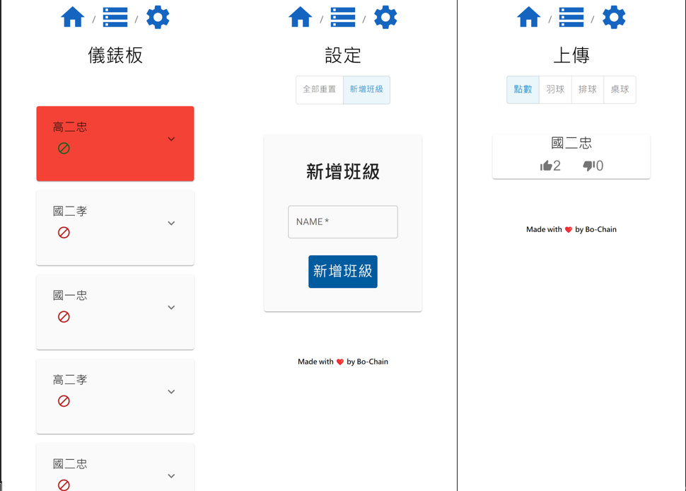

<div align="center">
</img>
<h1 align="center">Ball Regulation</h1>
</img>
</div>

## About Project

This a web app for Bliss & Wisdom high school to manage ball

## 🧐 What's inside?

```
src
    ├─components
    | # constant for all page
    │  └─imgs
    ├─page
    | # all pge
    │  ├─dashboard
    │  │  └─components
    |  ├─setting
    │  │  └─components
    │  └─home
    │      ├─components
    │      └─imgs
    └─utils
     # firebase setting
```

## Tech Stack

- @emotion/react@11.7.1
- @emotion/styled@11.6.0
- @mui/icons-material@5.4.1
- @mui/material@5.4.1
- firebase@9.6.6
- react-dom@17.0.2
- react-router-dom@6.2.1
- react-scripts@5.0.0
- react@17.0.2

## Future Plan

<h4 align="center">Made with ❤️ by Bo-Chain</h4>
